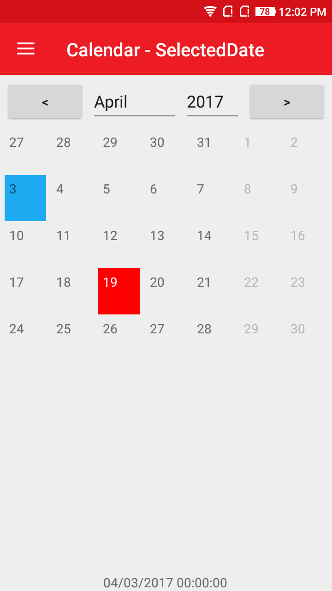
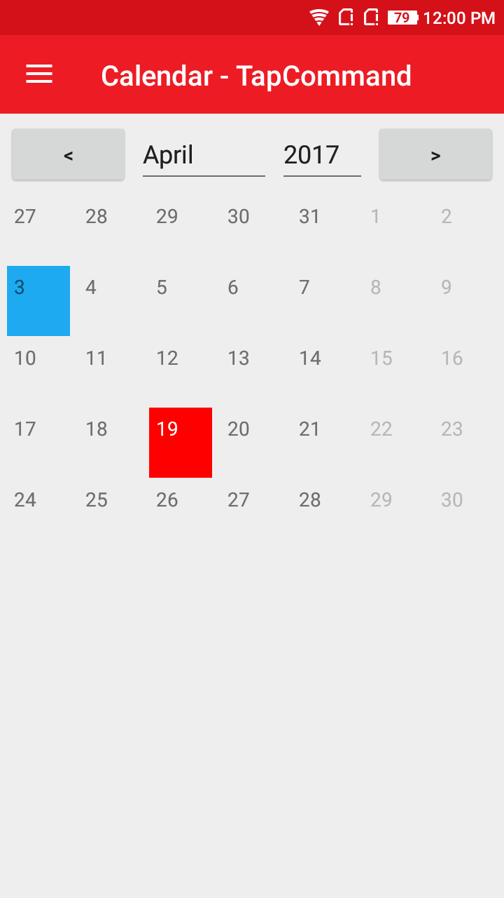
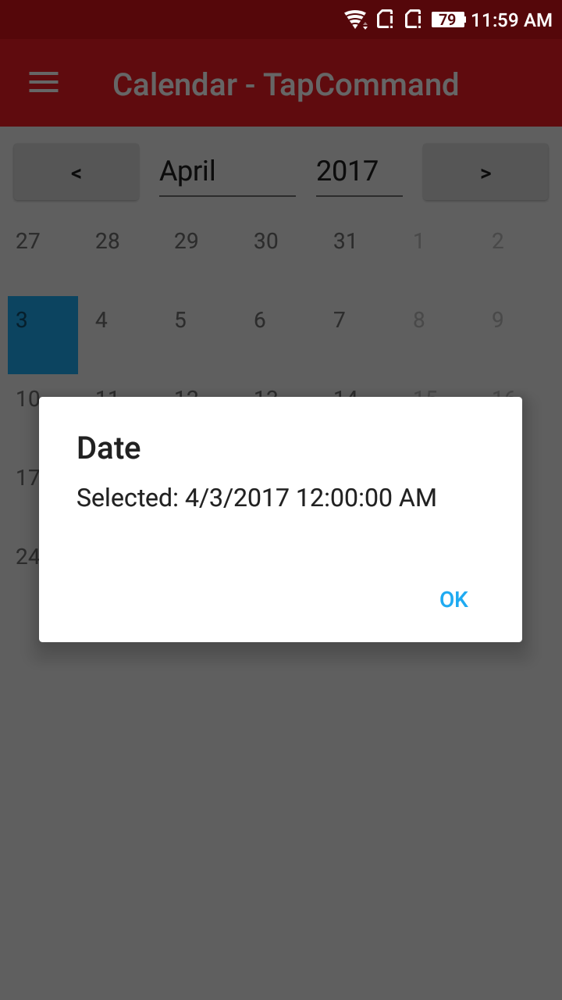
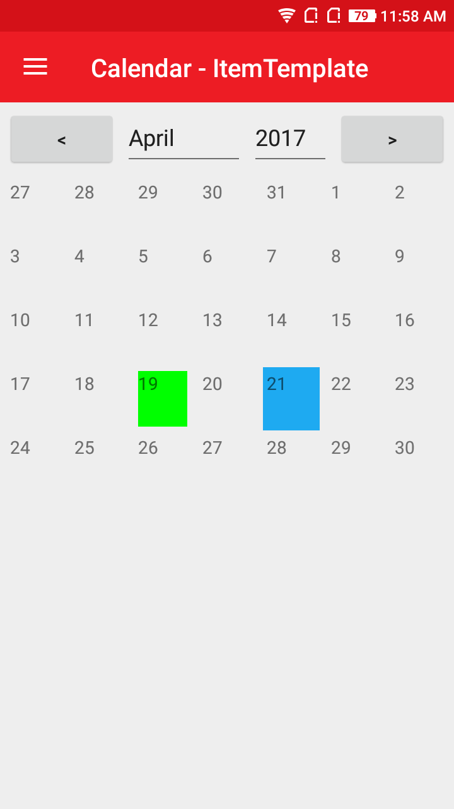
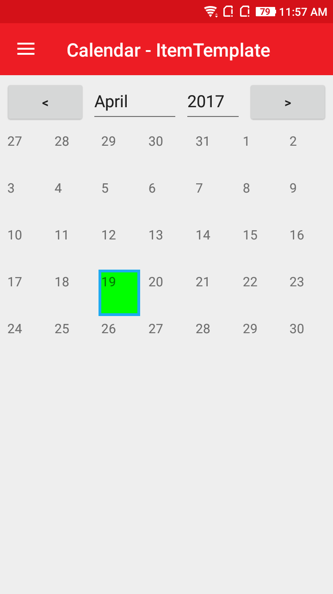


# AtomCalendar
A Simple Calendar control for your Xamarin.Forms projects.

## Screenshot
 

 
  

  
  

## Features
  * Easily bind selected Date to other controls.
  * Display selected Date in the form of alert.
  * Differentiate the current date with other dates(i.e Customizable background color).
  * Calendar with Highlighted Days.

## Usage

### XAML:
First add the xmlns namespace:

 xmlns:ns="clr-namespace:NeuroSpeech.UIAtoms.Controls;assembly=NeuroSpeech.UIAtoms"

Then add the control:

 <ns:AtomCalendar/>

Here is a sample:

  ```
 <ns:AtomCalendar x:Name="theCalendar"/>
 <Label 
      HorizontalOptions="Center"
      VerticalOptions="Center"
      Text="{Binding SelectedDate, Source={x:Reference theCalendar}}"/>
 ```
