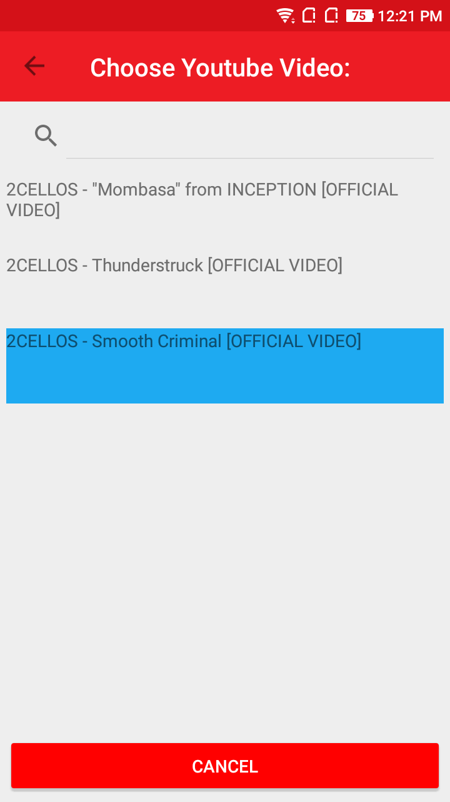
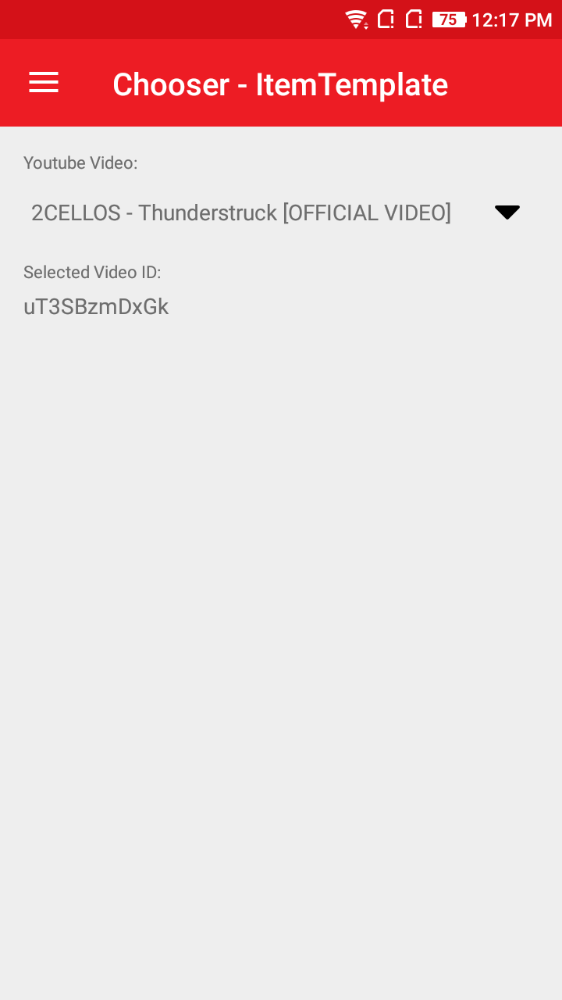
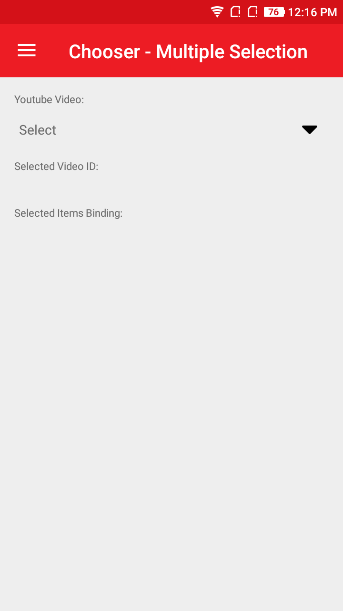
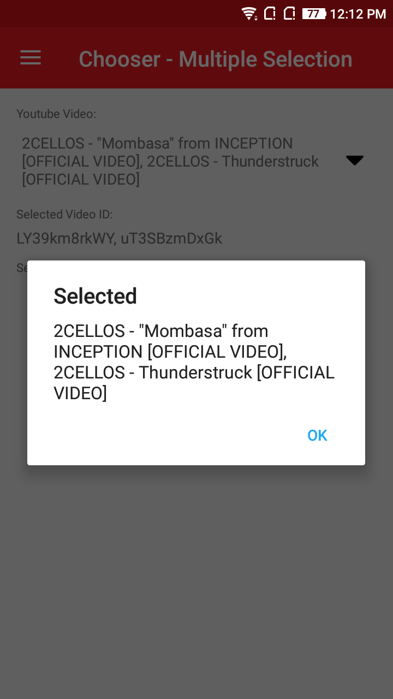
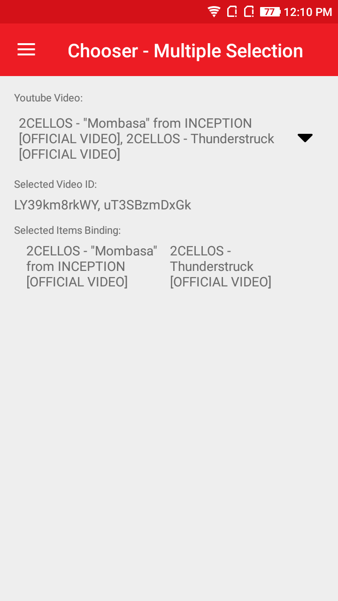

# AtomChooser
AtomChooser is a control for selecting a text item from a list of data. 

## Screenshot
    

    

      

## Features
  * AtomChooser supports both single and multiple selection with `CheckBox`.
  * It also provide inbuilt `Search` functionality within the list.
  * Contains support for Popup view.
  * Fast loading and smooth scrolling experience even for large data sets.
  * In AtomChooser `DataTemplate` can contain any `View` based items like `Button`, `Grid`, `Label`, everything except `Cell`.
