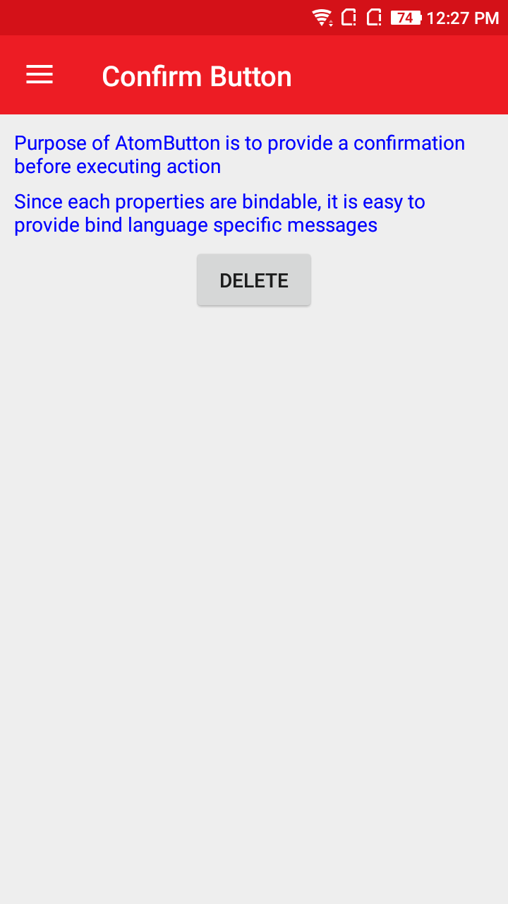
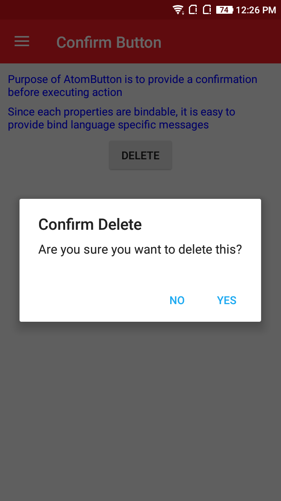
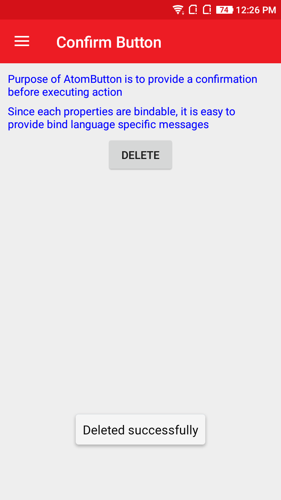

# AtomConfirmButton
AtomButton is used to provide a alert before saving changes.
Since each properties are bindable, it is easy to provide bind language specific messages.

## Screenshot
    

## Usage

### XAML:
First add the xmlns namespace:

 xmlns:ns="clr-namespace:NeuroSpeech.UIAtoms.Controls;assembly=NeuroSpeech.UIAtoms"

Then add the control:

 <ns:AtomButton/>

Here is a sample:

  ```
 <ns:AtomButton
            Confirm="True"
            Command="{Binding DeleteCommand}"
            ConfirmMessage="Are you sure you want to delete this?"
            ConfirmTitle="Confirm Delete"
            ConfirmButtonText="Yes"
            CancelButtonText="No"
            Text="Delete"
            HorizontalOptions="CenterAndExpand"
            VerticalOptions="Center"/>
 ```