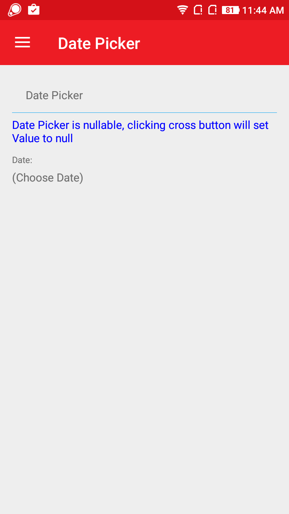
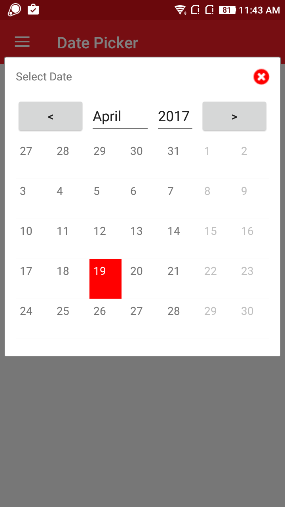
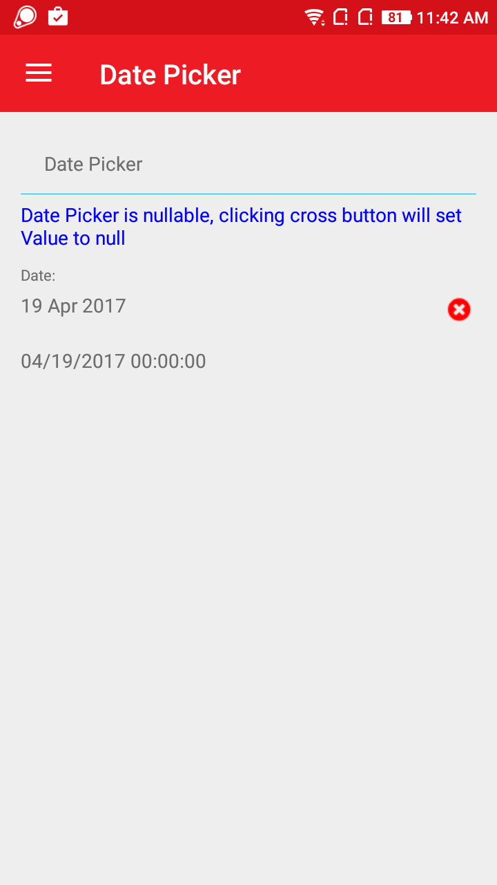

# AtomDatePicker
AtomDatePicker control is an alternative for Calendar in Xamarin.Forms projects.

## Screenshot
    

## Features
* Customize look for Calendar by showing in Popup view.
* Value can be set to null by clicking cross.

## Usage

### XAML:
First add the xmlns namespace:

 xmlns:ns="clr-namespace:NeuroSpeech.UIAtoms.Controls;assembly=NeuroSpeech.UIAtoms"

Then add the control:

 <ns:AtomDatePicker Value="....."/>

Here is a sample:
  ```
 <ns:AtomDatePicker 
                    ns:AtomForm.Label="Date:"
                    Value="{Binding SelectedDate}"/>
 <Label Text="{Binding SelectedDate}"/>
 ```