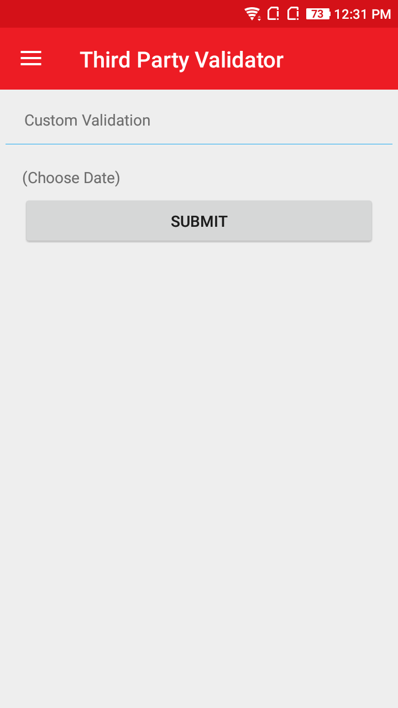
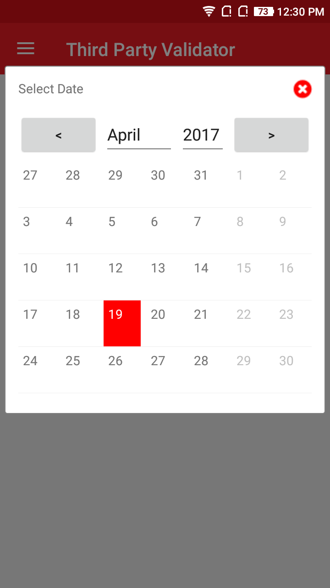
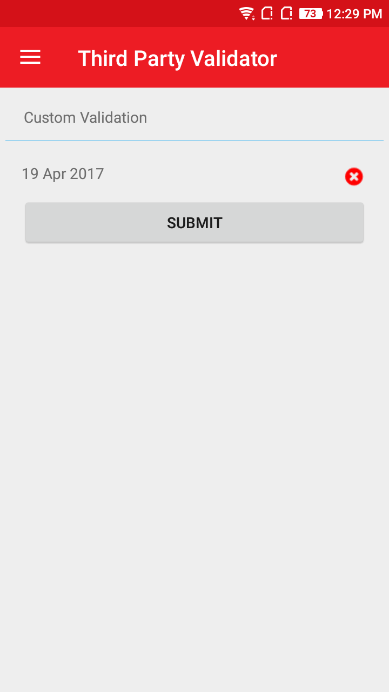

# Third party control validations
It simply validates the third party control in the form.

## Screenshot
    

## Usage

### XAML:
First add the xmlns namespace:

 xmlns:ns="clr-namespace:NeuroSpeech.UIAtoms.Controls;assembly=NeuroSpeech.UIAtoms"

Then add the control.

Here is a sample:
  ```
  <ns:AtomDatePicker 
                ns:AtomForm.Label="Birth Date"
                ns:AtomForm.IsRequired="True">
                <ns:AtomForm.Validator>
                    <nsv:AtomPropertyValidator Property="Value" ValidationRule="......."/>
                </ns:AtomForm.Validator>
  </ns:AtomDatePicker>
  ```