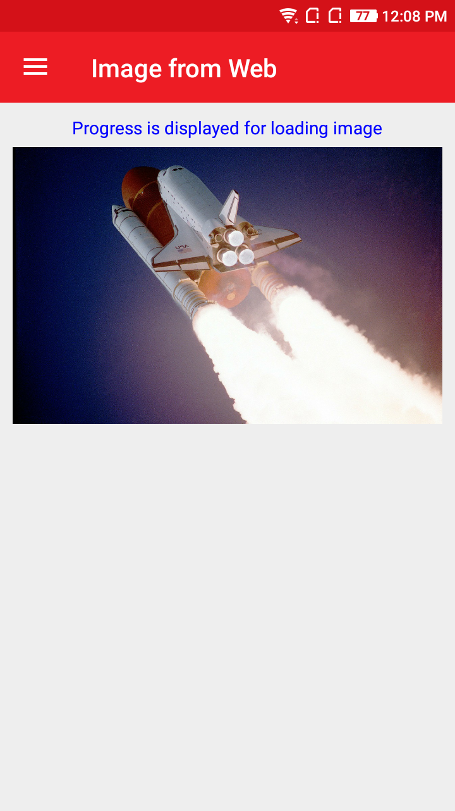
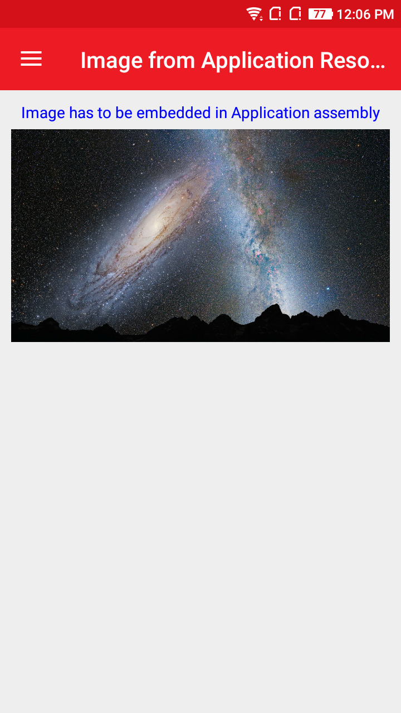

# AtomImage
AtomImage is a control that displays Images for Xamarin.Forms projects.

## Screenshot
{:height="300px" width="250px"}  {:height="300px" width="250px"}

{:height="300px" width="250px"}  {:height="300px" width="250px"}

## Features
 * Ability to display progress while loading image.
 * Loads Image from Image from Web.
 * Loads Image from Assembly Resource.
 * Loads Image from Application Resource.
 * Ability to load images from embedded DLL resources via `app-res://` and `res://AssemblyName/ResourceName` format