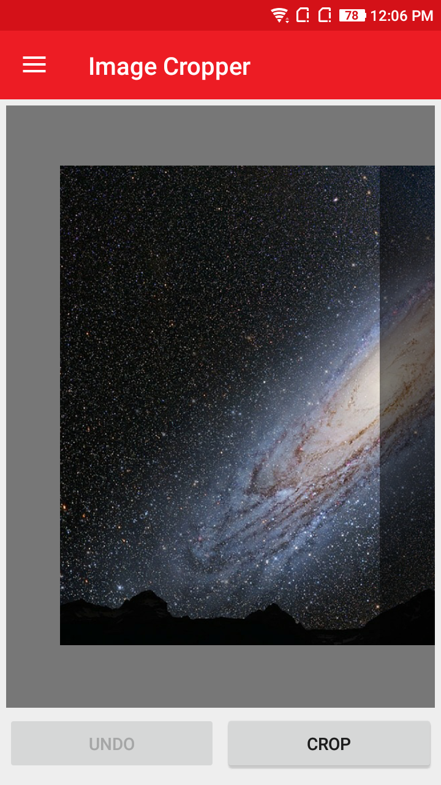
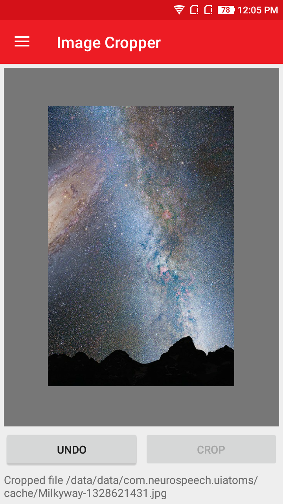

# AtomImageCropper
AtomImageCropper is a useful image cropping control for Xamarin.Forms projects.

## Screenshot
  

## Features
 * Zoom In and Out feature
 * Adjustable CropAspectRatio.
 * Maintains Image clearity.

 ## Usage

### XAML:
First add the xmlns namespace:

 xmlns:ns="clr-namespace:NeuroSpeech.UIAtoms.Controls;assembly=NeuroSpeech.UIAtoms"

Then add the control:

 <ns:AtomImageCropper Source="..."/>

Here is a sample :

 ```
 <ns:AtomImageCropper
            x:Name="cropper"
            Source="app-res:///AppImages/Milkyway.jpg"
            CropAspectRatio="0.667"/>
 ```