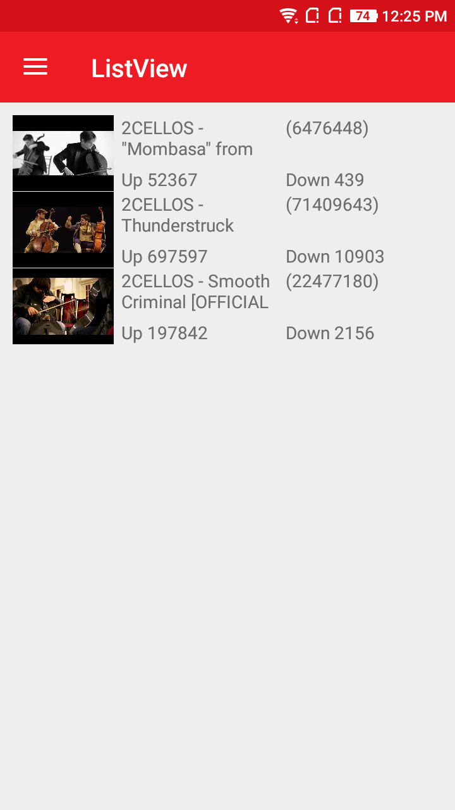
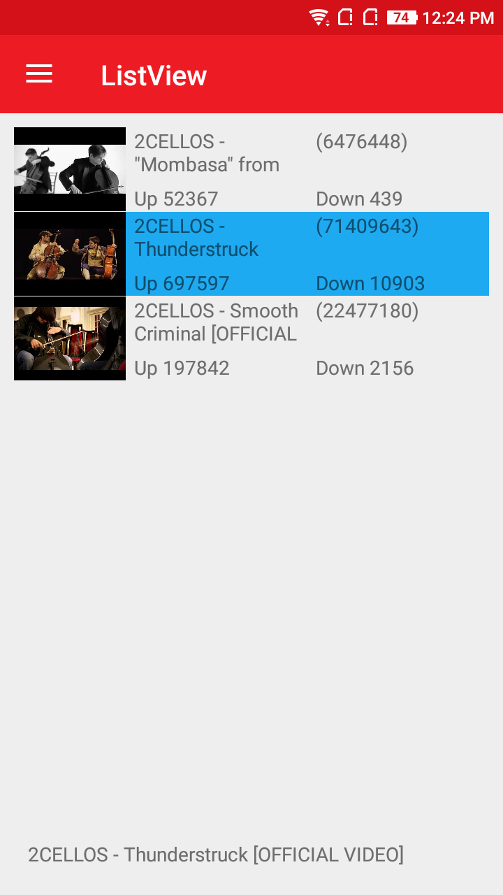
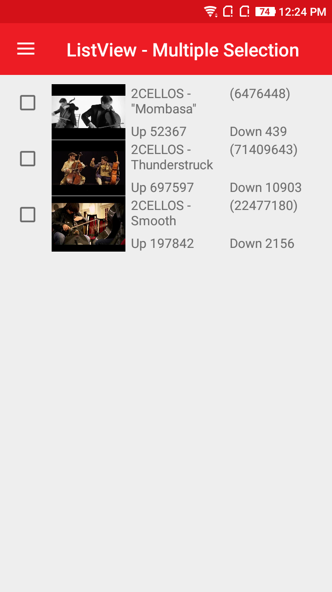
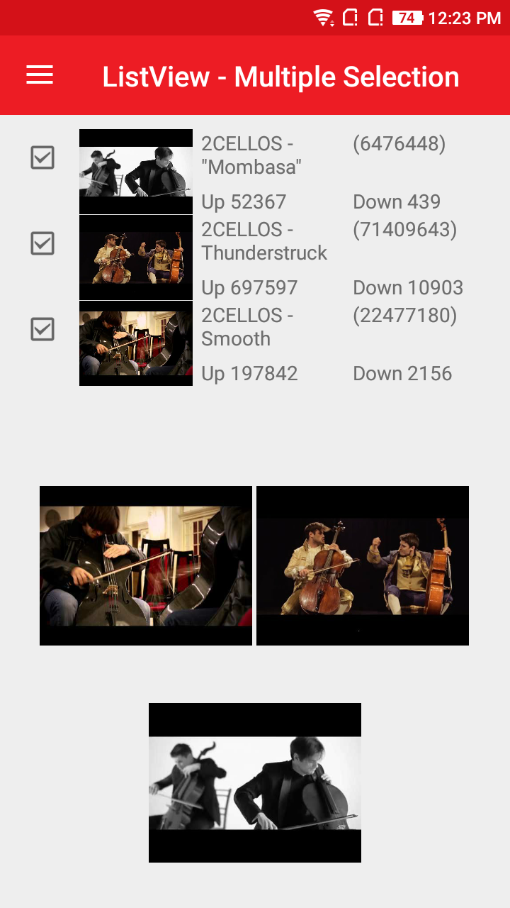

# AtomListView
AtomListView is a control that displays lists of data, especially long lists that require scrolling. 

## Screenshot
  

  

## Features
  * AtomListView supports both single and multiple selection with `CheckBox`.
  * Fast loading and smooth scrolling experience even for large data sets.
  * Optimizes the initial loading of the app and the new items are loaded before the user reaches the bottom of the ListView.
  * In AtomListView `DataTemplate` can contain any `View` based items like `Button`, `Grid`, `Label`, everything except `Cell`.

