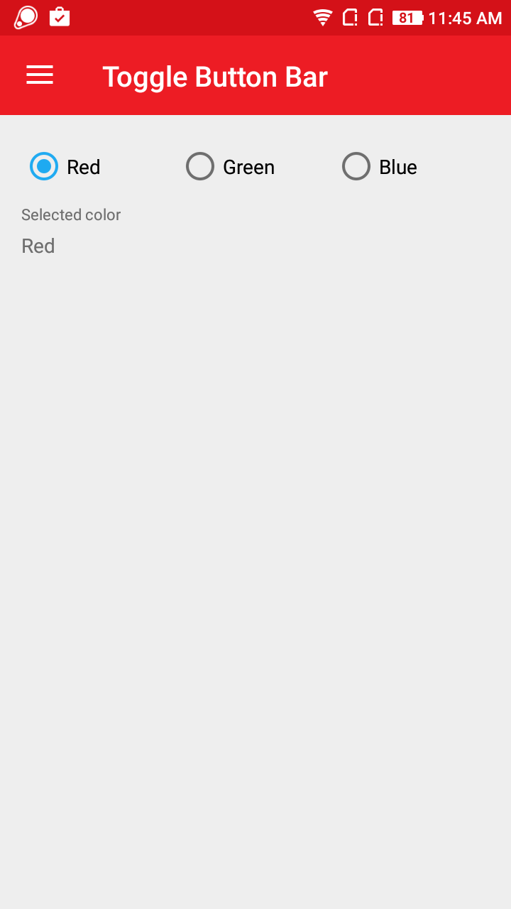
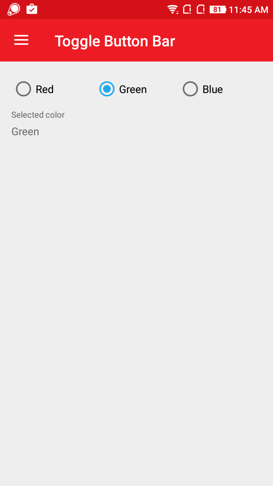
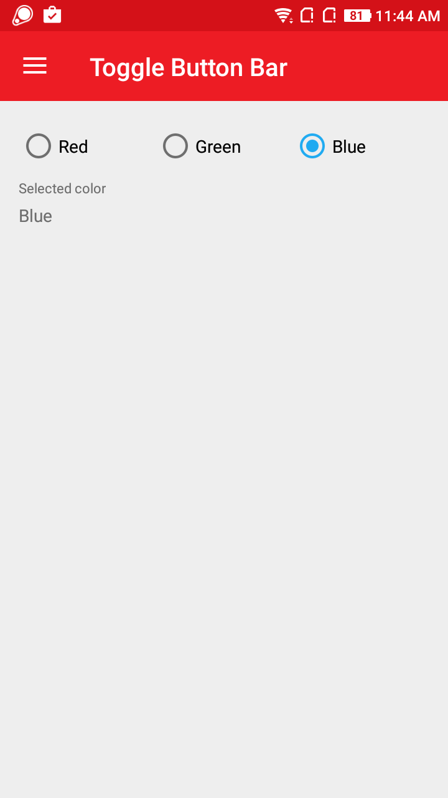

# AtomToggleButtonBar
AtomToggleButtonBar is simple horizontal toggle button bar used specifically for toggling between two or more states. It is an excellent alternative to radio buttons.

## Screenshot
    

## Features
 * Can add more number of options.
 * Easily bind selected option to other controls.
