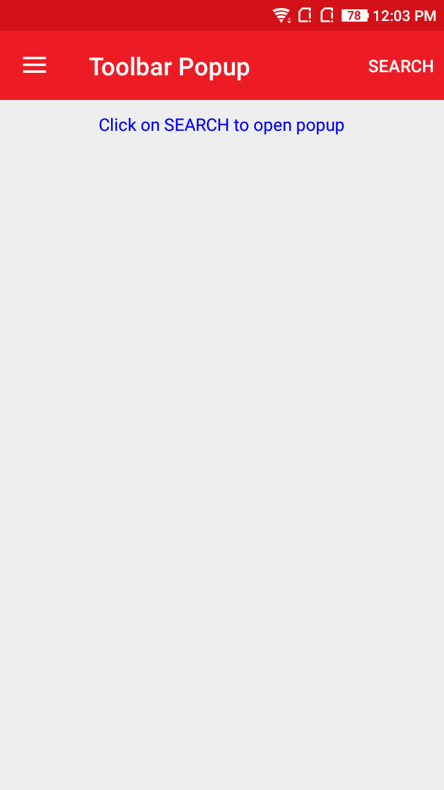
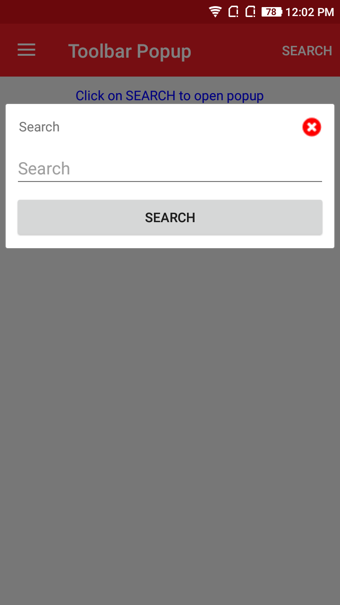
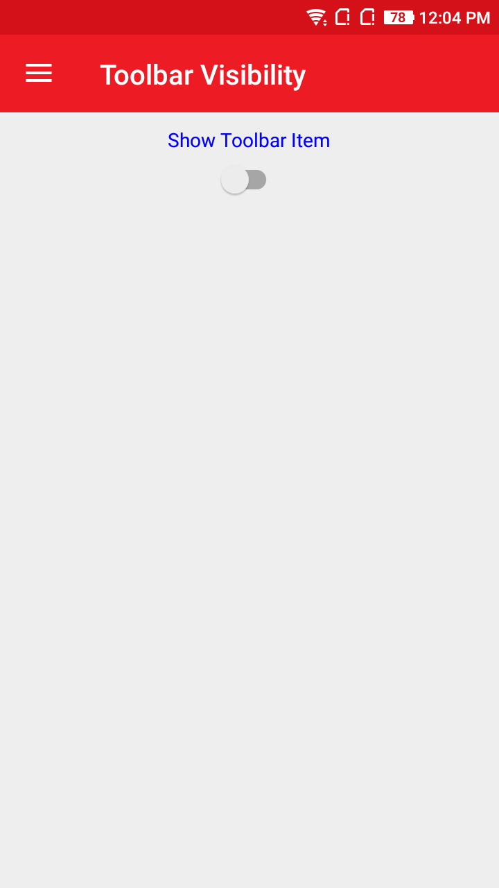
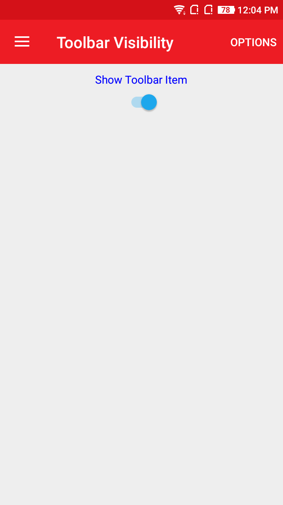

# * AtomPopupToolbarItem
AtomPopupToolbarItem when clicked it opens up in Popup view.

## Screenshot
  

## Usage

### XAML:
First add the xmlns namespace:

 xmlns:ns="clr-namespace:NeuroSpeech.UIAtoms.Controls;assembly=NeuroSpeech.UIAtoms"

Then add the control

 <ns:AtomPopupToolbarItem Text="Search"> 

Here is a sample:
  ```
  <ContentPage.ToolbarItems>
       <ns:AtomPopupToolbarItem Text="Search">
            <DataTemplate>
                <StackLayout Orientation="Vertical" Spacing="5">
                    <Entry ns:AtomForm.Label="Search" Placeholder="Search"/>
                    <ns:AtomButton 
                        Command="{Binding SearchCommand}"
                        Text="Search"/>
                </StackLayout>
            </DataTemplate>
       </ns:AtomPopupToolbarItem>
  </ContentPage.ToolbarItems>
  ```


# * AtomToolbarItem
AtomToolbarItem is same as ToolbarItems in Xamarin.Forms project. Items visibility can be handle by other controls also.

## Screenshot
{:height="300px" width="250px"}  {:height="300px" width="250px"}

## Usage

### XAML:
First add the xmlns namespace:

 xmlns:ns="clr-namespace:NeuroSpeech.UIAtoms.Controls;assembly=NeuroSpeech.UIAtoms"

Then add the control

 <ns:AtomToolbarItem Text="Options"> 

Here is a sample:
  ```
  <ContentPage.ToolbarItems>
        <ns:AtomToolbarItem 
            IsVisible="{Binding ShowOption}"
            Text="Options"
            Command="{Binding OptionCommand}"></ns:AtomToolbarItem>
  </ContentPage.ToolbarItems>
  ```