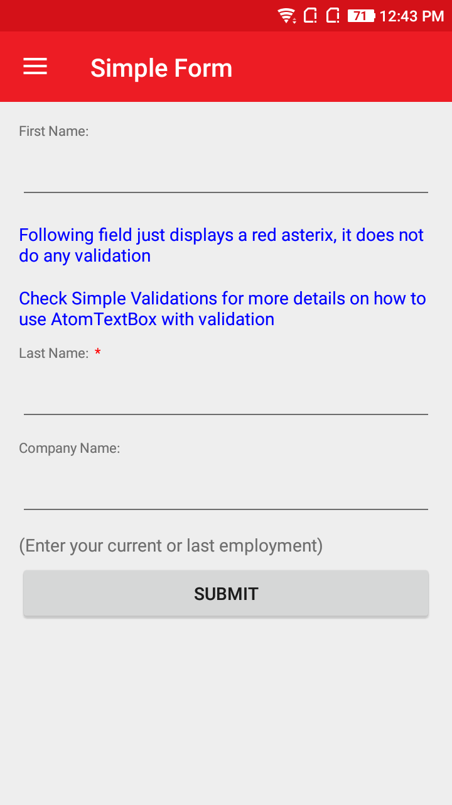
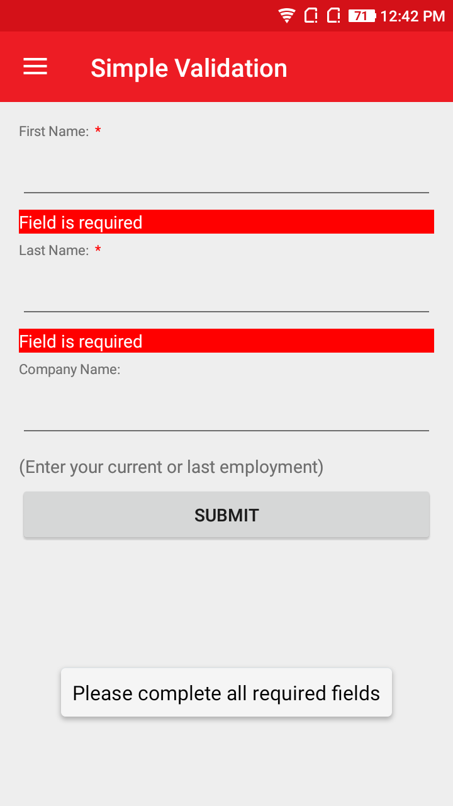
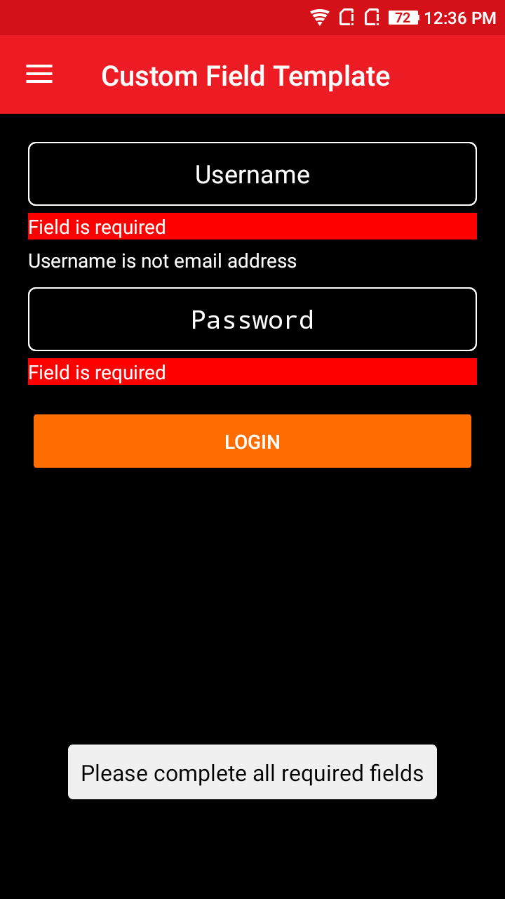
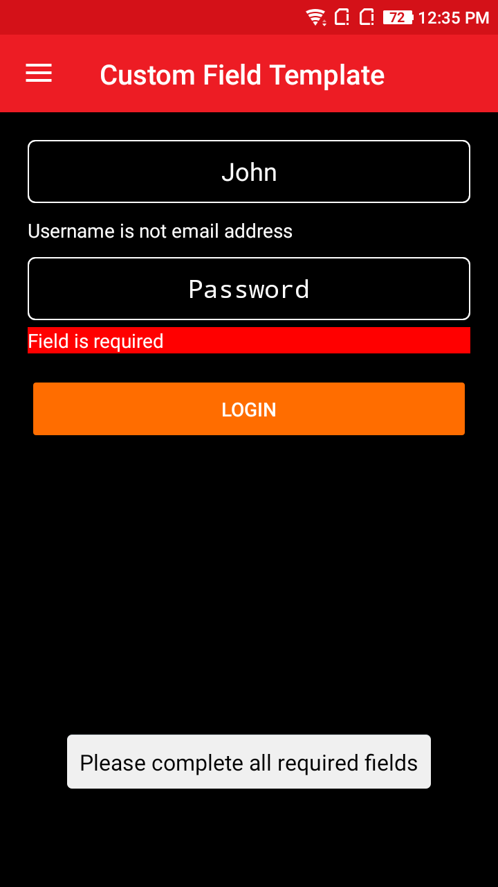

# AtomForm
AtomForm is a simple Form with or without Validation.

## Screenshot

       

      

## Features
* Simple validation.
* Enables Field grouping.
* Search field for large forms.
* Custom Validations.

